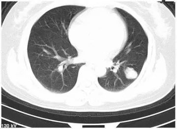
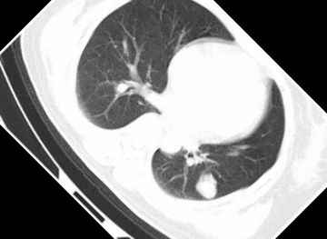
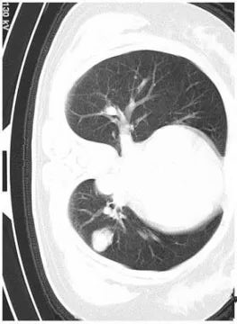
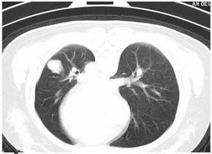
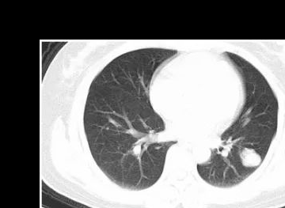
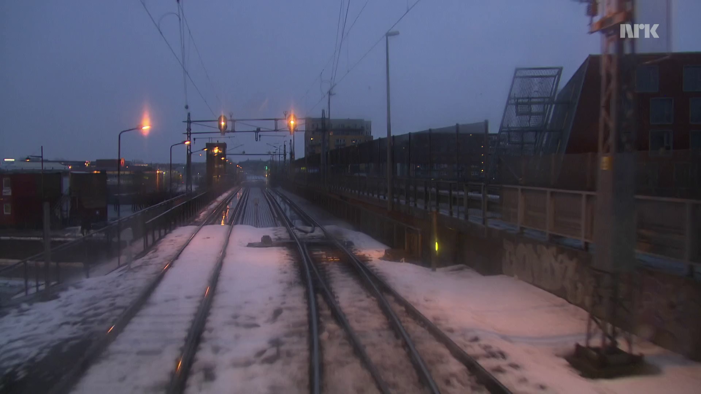
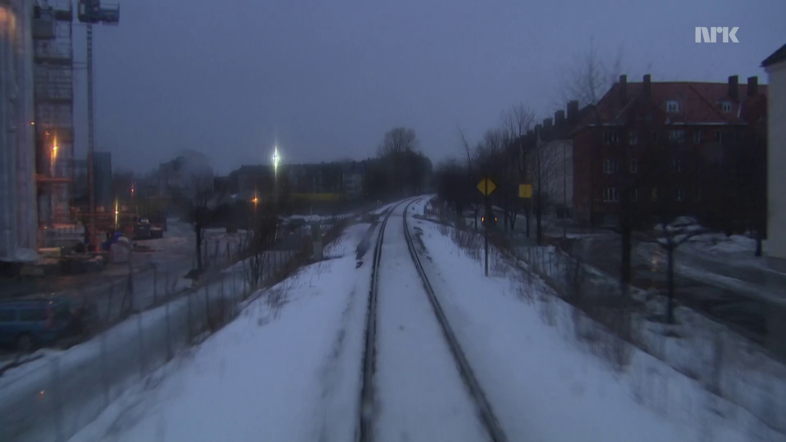
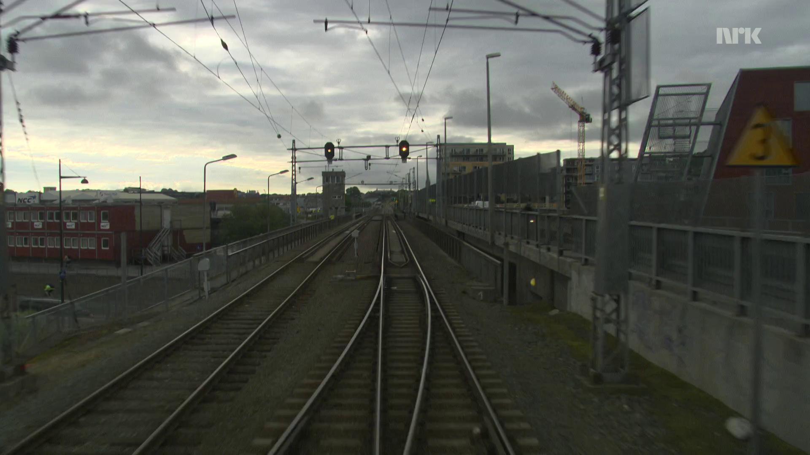

difrent_image_moments_invariant.py
这是类间 不同图像的 不变矩计算 
Moment_invariant.py
类内图像的旋转 缩放 平移 不变矩计算
代码说明：

1. ##### 计算不变矩首先要计算图像的归一化中心距 python opencv 函数 cv2.moments(img) 自己实现（copy 源码。。。。）函数：get_moments（img）前者结果是一个keymap 24个元素 分别是 [opencv moments成员变量](https://docs.opencv.org/3.4/d8/d23/classcv_1_1Moments.html)后者是一个list 也是24个 分布式  原点矩 0 阶：1个； 1阶：2个； 2阶：3个； 三阶：4 个； 中心矩阵只有七个 2阶：3个；三阶4个；归一化中心矩 二阶 3个 ；三阶 4个；后面两个少了是因为少的那些为0了 具体看上面的链接

2.  拿到上面的各种矩 之后计算HU不变矩 opencv函数 cv2.HuMoments(moments) 参数是 上一步的24个矩 自己。。实现。。：get_hu_moments(numom) 参数是归一化中心矩 只有七个 一个list作为输入

3. 然后没了 hu不变矩阵的公式如下：参考[opencv hu Moments 说明](https://docs.opencv.org/4.1.2/d3/dc0/group__imgproc__shape.html#gab001db45c1f1af6cbdbe64df04c4e944)

$$hu[0]= \eta _{20}+ \eta _{02} \\
 hu[1]=( \eta _{20}- \eta _{02})^{2}+4 \eta _{11}^{2} \\
  hu[2]=( \eta _{30}-3 \eta _{12})^{2}+ (3 \eta _{21}- \eta _{03})^{2} 
  \\   hu[3]=( \eta _{30}+ \eta _{12})^{2}+ ( \eta _{21}+ \eta _{03})^{2} 
  \\  hu[4]=( \eta _{30}-3 \eta _{12})( \eta _{30}+ \eta _{12})[( \eta _{30}+ \eta _{12})^{2}-3( \eta _{21}+ \eta _{03})^{2}]+(3 \eta _{21}- \eta _{03})( \eta _{21}+ \eta _{03})[3( \eta _{30}+ \eta _{12})^{2}-( \eta _{21}+ \eta _{03})^{2}] 
  \\ hu[5]=( \eta _{20}- \eta _{02})[( \eta _{30}+ \eta _{12})^{2}- ( \eta _{21}+ \eta _{03})^{2}]+4 \eta _{11}( \eta _{30}+ \eta _{12})( \eta _{21}+ \eta _{03}) 
  \\ hu[6]=(3 \eta _{21}- \eta _{03})( \eta _{21}+ \eta _{03})[3( \eta _{30}+ \eta _{12})^{2}-( \eta _{21}+ \eta _{03})^{2}]-( \eta _{30}-3 \eta _{12})( \eta _{21}+ \eta _{03})[3( \eta _{30}+ \eta _{12})^{2}-( \eta _{21}+ \eta _{03})^{2}] \\$$
result

原图

<figure class="third">    
        
       
      
</figure>

<figure class="third">
     
    
    
</figure>

同一个图片 不同处理

| 不变矩 | 原图        | 一半尺寸    | 旋转45度    | 旋转90度    | 旋转180度   | 列平移50像素 行平移15像素 |
| ------ | ----------- | ----------- | ----------- | ----------- | ----------- | ------------------------- |
| 1      | 6.95973732  | 6.98678099  | 6.97163774  | 6.95973732  | 6.95973732  | 6.93737189                |
| 2      | 16.03925665 | 16.63356264 | 15.74861701 | 16.03925665 | 16.03925665 | 16.04166115               |
| 3      | 26.40546892 | 26.77700302 | 2.49E+01    | 26.40546892 | 26.40546892 | 25.60222615               |
| 4      | 26.85479808 | 28.08502812 | 25.92797348 | 26.85479808 | 26.85479808 | 27.51780027               |
| 5      | 53.73331495 | 55.53453039 | 51.35178959 | 5.37E+01    | 53.73331495 | 54.23128573               |
| 6      | 34.88382778 | 38.07147743 | 33.90929305 | 34.88382778 | 34.88382778 | 35.60791785               |
| 7      | 53.95380994 | 57.17403697 | 53.09311138 | 53.95380994 | 53.95380994 | 54.74313246               |

<figure class="fourth">
     
    
    
    
</figure>

不同的图片

| 不变矩 | Winter_0    | Summer_0    | summer_357  | Winter_85   |
| ------ | ----------- | ----------- | ----------- | ----------- |
| 1      | 6.06E+00    | 6.21279822  | 6.41897124  | 6.06223521  |
| 2      | 13.97355341 | 13.54897708 | 14.32848396 | 14.0651294  |
| 3      | 25.49413374 | 23.67728933 | 23.65970171 | 25.02867178 |
| 4      | 22.85900303 | 21.49827435 | 22.39041427 | 24.1427005  |
| 5      | 49.20278733 | 46.18844503 | 45.41641548 | 49.41575619 |
| 6      | 29.88113698 | 28.70095592 | 30.21606721 | 31.48431494 |
| 7      | 47.04216941 | 44.09357449 | 48.55247541 | 48.87416848 |

图片出处。。。。

【所属科室】呼吸科

【基本资料】患者

【主诉】左侧胸痛一天，盗汗三月余

【影像图片】

【病例】肺错构瘤1例CT影像表现

【病例】肺错构瘤1例CT影像表现

【讨论问题】诊断？

【医学影像APP用户讨论】

评论：左下肺见结节状混杂密度影，边缘光滑，境界清晰，内见斑点状钙化，考虑错构瘤。

【病理结果】

穿刺证实为错构瘤

【病例小结】

肺错构瘤的发病率在肺部良性肿瘤中占第1位，肺错构瘤的来源和发病原因尚不分清楚，比较容易被接受的假说认为错构瘤是支气管的片组织在胚胎发育时期倒转和脱落被正常肺组织包绕，这部分组织生长缓慢也可能在定时期内不生长，以后逐渐发展才形成瘤，错构瘤大多数在40岁以后发病这个事实支持这假说。

错构瘤的诊断主要依靠X线检查，多数是在X线常规检查时偶然发现的，X或CT线上表现为均匀致密的阴影，也可以不均匀阴影，还可以有钙化钙化影，呈现爆米花状的图案，周边部密度相对较低可能为脂肪组织。爆米花征是肺错构瘤的特征性表现。
